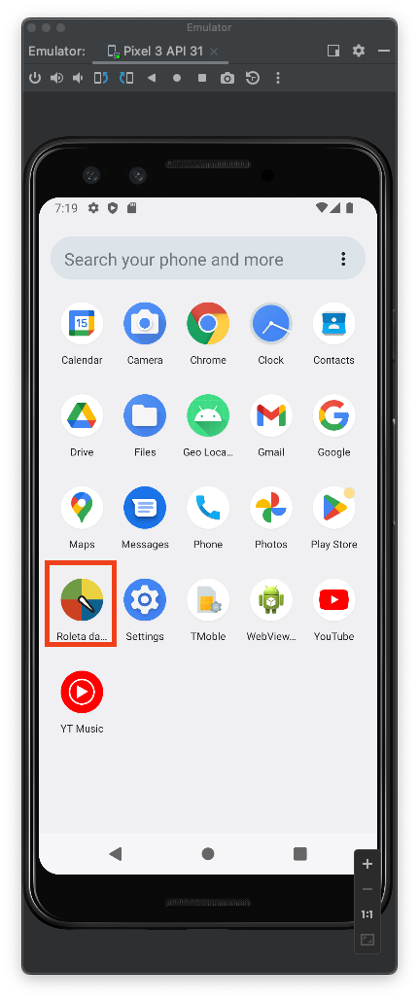

# Número Sorteado
VersionCode: 1.0

VersionName: "1"

# Introdução
Aplicativo didatico demostrando a utilização da linguagem de programação kotlin no desenvolvimento de aplicativos.

Foi construído uma rola que varia no intervalo de 0 a 10.

Sera solicitado um número entre 0 e 10, onde vamos verificar se esse mesmo número foi sorteado, se sim será exibido um mensagem parabenizado pelo acero, caso contrario tente novamente.

| Telas | Telas     | Telas     |
| ------------- | ------------- | ------------- |
||||
||||
||x|x|

# Authors

Danilo Santos
[@danilopsnts](https://www.linkedin.com/in/danilopsnts/)